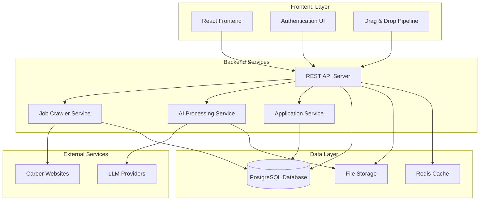

# Design Document

## Overview

The Job Application Automation Platform is a full-stack web application that automates job discovery, application processes, and pipeline management for tech/IT job seekers. The system integrates web scraping, AI-powered document processing, automated form filling, and a drag-and-drop interface for managing job applications.

## Architecture

### High-Level Architecture



### Technology Stack

**Frontend:**
- React 18 with TypeScript for type safety
- React DnD for drag-and-drop functionality
- Tailwind CSS for responsive styling
- React Query for state management and API caching
- React Router for navigation

**Backend:**
- Node.js with Express.js framework
- TypeScript for type safety
- JWT for authentication
- Multer for file uploads
- Puppeteer for web scraping
- Bull Queue for background job processing

**Database & Storage:**
- PostgreSQL for relational data
- Redis for caching and job queues
- Local file system or cloud storage for resume files

**AI Integration:**
- Configurable LLM clients (OpenAI, Claude, Gemini, Ollama)
- PDF parsing libraries (pdf-parse, pdf2pic)
- Document generation utilities

## Components and Interfaces

### Frontend Components

#### Authentication Module
- `LoginForm`: User login interface
- `SignupForm`: User registration interface  
- `AuthProvider`: Context provider for authentication state
- `ProtectedRoute`: Route wrapper for authenticated pages

#### Dashboard Module
- `Dashboard`: Main application interface
- `JobPipeline`: Drag-and-drop job management interface
- `JobCard`: Individual job display component
- `JobModal`: Detailed job information popup
- `ProfileSection`: User profile management
- `ConfigSection`: LLM and system configuration

#### Job Management Module
- `JobList`: Filterable job listings
- `JobSearch`: Search and filter interface
- `ApplicationTracker`: Application status management
- `DocumentViewer`: Resume and cover letter preview

### Backend Services

#### API Layer (`/api`)
```typescript
interface APIEndpoints {
  // Authentication
  'POST /auth/login': { email: string, password: string } → { token: string, user: User }
  'POST /auth/register': UserRegistration → { token: string, user: User }
  
  // User Management
  'GET /user/profile': {} → User
  'PUT /user/profile': UserUpdate → User
  'POST /user/resume': FormData → { resumeId: string }
  
  // Job Management
  'GET /jobs': JobFilters → Job[]
  'GET /jobs/:id': {} → Job
  'POST /jobs/:id/apply': {} → Application
  'PUT /applications/:id/status': { status: ApplicationStatus } → Application
  
  // Configuration
  'GET /config/llm': {} → LLMConfig
  'PUT /config/llm': LLMConfig → LLMConfig
}
```

#### Job Crawler Service
```typescript
interface JobCrawlerService {
  crawlCompanies(): Promise<Job[]>
  extractJobData(url: string): Promise<JobData>
  validateJobExists(job: Job): Promise<boolean>
  scheduleRecrawl(): void
}
```

#### AI Processing Service
```typescript
interface AIService {
  parseResume(file: Buffer): Promise<ParsedResume>
  generateCoverLetter(resume: ParsedResume, job: Job): Promise<string>
  matchJobs(userProfile: UserProfile, jobs: Job[]): Promise<JobMatch[]>
}
```

#### Application Service
```typescript
interface ApplicationService {
  autoFillApplication(job: Job, userProfile: UserProfile): Promise<ApplicationData>
  submitApplication(applicationData: ApplicationData): Promise<ApplicationResult>
  trackApplicationStatus(applicationId: string): Promise<ApplicationStatus>
}
```

## Data Models

### Core Entities

```typescript
interface User {
  id: string
  email: string
  passwordHash: string
  profile: UserProfile
  createdAt: Date
  updatedAt: Date
}

interface UserProfile {
  name: string
  age?: number
  location: string
  resumeId?: string
  skills: string[]
  experience: ExperienceLevel
  preferences: JobPreferences
}

interface Job {
  id: string
  title: string
  company: string
  location: string
  description: string
  requirements: string[]
  experienceLevel: ExperienceLevel
  applicationUrl: string
  isAvailable: boolean
  crawledAt: Date
  updatedAt: Date
}

interface Application {
  id: string
  userId: string
  jobId: string
  status: ApplicationStatus
  appliedAt: Date
  coverLetter?: string
  notes?: string
  interviewDate?: Date
  statusHistory: StatusChange[]
}

type ApplicationStatus = 'applied' | 'interview' | 'offered' | 'rejected'
type ExperienceLevel = 'entry' | 'mid' | 'senior' | 'lead'
```

### Database Schema

```sql
-- Users table
CREATE TABLE users (
  id UUID PRIMARY KEY DEFAULT gen_random_uuid(),
  email VARCHAR(255) UNIQUE NOT NULL,
  password_hash VARCHAR(255) NOT NULL,
  created_at TIMESTAMP DEFAULT NOW(),
  updated_at TIMESTAMP DEFAULT NOW()
);

-- User profiles table
CREATE TABLE user_profiles (
  id UUID PRIMARY KEY DEFAULT gen_random_uuid(),
  user_id UUID REFERENCES users(id) ON DELETE CASCADE,
  name VARCHAR(255) NOT NULL,
  age INTEGER,
  location VARCHAR(255),
  resume_id VARCHAR(255),
  skills TEXT[],
  experience_level VARCHAR(50),
  preferences JSONB,
  created_at TIMESTAMP DEFAULT NOW(),
  updated_at TIMESTAMP DEFAULT NOW()
);

-- Jobs table
CREATE TABLE jobs (
  id UUID PRIMARY KEY DEFAULT gen_random_uuid(),
  title VARCHAR(255) NOT NULL,
  company VARCHAR(255) NOT NULL,
  location VARCHAR(255),
  description TEXT,
  requirements TEXT[],
  experience_level VARCHAR(50),
  application_url TEXT,
  is_available BOOLEAN DEFAULT true,
  crawled_at TIMESTAMP DEFAULT NOW(),
  updated_at TIMESTAMP DEFAULT NOW()
);

-- Applications table
CREATE TABLE applications (
  id UUID PRIMARY KEY DEFAULT gen_random_uuid(),
  user_id UUID REFERENCES users(id) ON DELETE CASCADE,
  job_id UUID REFERENCES jobs(id) ON DELETE CASCADE,
  status VARCHAR(50) NOT NULL,
  applied_at TIMESTAMP DEFAULT NOW(),
  cover_letter TEXT,
  notes TEXT,
  interview_date TIMESTAMP,
  UNIQUE(user_id, job_id)
);

-- Application status history
CREATE TABLE status_changes (
  id UUID PRIMARY KEY DEFAULT gen_random_uuid(),
  application_id UUID REFERENCES applications(id) ON DELETE CASCADE,
  from_status VARCHAR(50),
  to_status VARCHAR(50) NOT NULL,
  changed_at TIMESTAMP DEFAULT NOW(),
  notes TEXT
);
```

## Error Handling

### Error Categories

1. **Authentication Errors**: Invalid credentials, expired tokens
2. **Validation Errors**: Invalid input data, missing required fields
3. **External Service Errors**: LLM API failures, website scraping issues
4. **Database Errors**: Connection issues, constraint violations
5. **File Processing Errors**: Resume parsing failures, file upload issues

### Error Response Format

```typescript
interface ErrorResponse {
  error: {
    code: string
    message: string
    details?: any
    timestamp: string
  }
}
```

### Error Handling Strategy

- **Frontend**: Global error boundary with user-friendly messages
- **Backend**: Centralized error middleware with logging
- **Retry Logic**: Exponential backoff for external API calls
- **Fallbacks**: Manual data entry when AI parsing fails
- **Monitoring**: Error tracking and alerting system

## Testing Strategy

### Unit Testing
- **Frontend**: Jest + React Testing Library for component testing
- **Backend**: Jest for service and utility function testing
- **Database**: In-memory database for repository testing
- **AI Services**: Mock LLM responses for consistent testing

### Integration Testing
- **API Testing**: Supertest for endpoint testing
- **Database Integration**: Test database with real PostgreSQL
- **External Services**: Mock external APIs and websites
- **File Processing**: Test with sample resume files

### End-to-End Testing
- **User Flows**: Playwright for complete user journey testing
- **Authentication**: Login/logout and session management
- **Job Pipeline**: Drag-and-drop functionality testing
- **Application Process**: Complete job application workflow

### Performance Testing
- **Load Testing**: Concurrent user simulation
- **Database Performance**: Query optimization testing
- **Scraping Performance**: Website crawling efficiency
- **AI Processing**: Response time measurement for LLM calls

## Security Considerations

### Authentication & Authorization
- JWT tokens with secure expiration
- Password hashing with bcrypt
- Role-based access control
- Session management and logout

### Data Protection
- Input validation and sanitization
- SQL injection prevention
- XSS protection
- File upload security (type validation, size limits)

### External Integrations
- API key management and rotation
- Rate limiting for external services
- Secure credential storage
- HTTPS enforcement

### Privacy
- User data encryption at rest
- Secure file storage
- Data retention policies
- GDPR compliance considerations